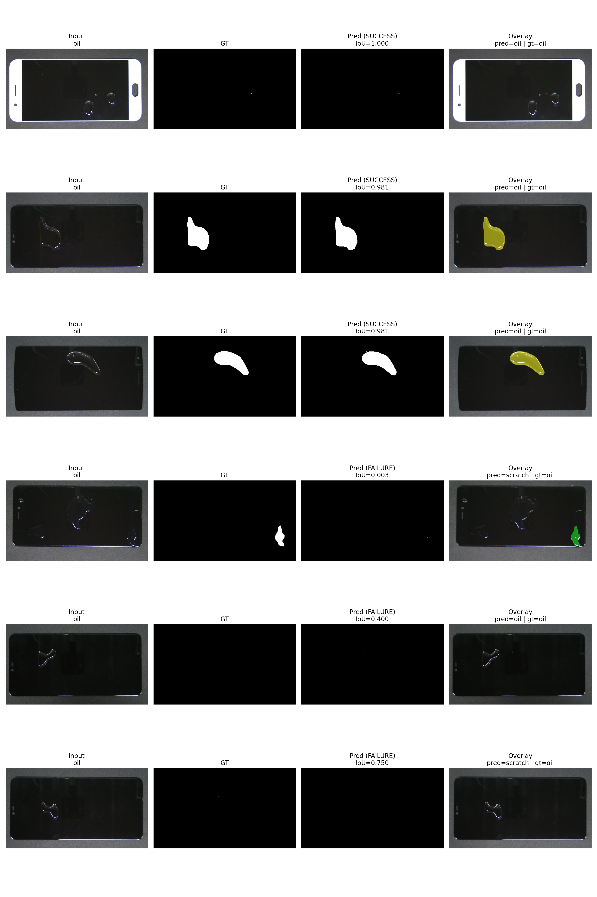
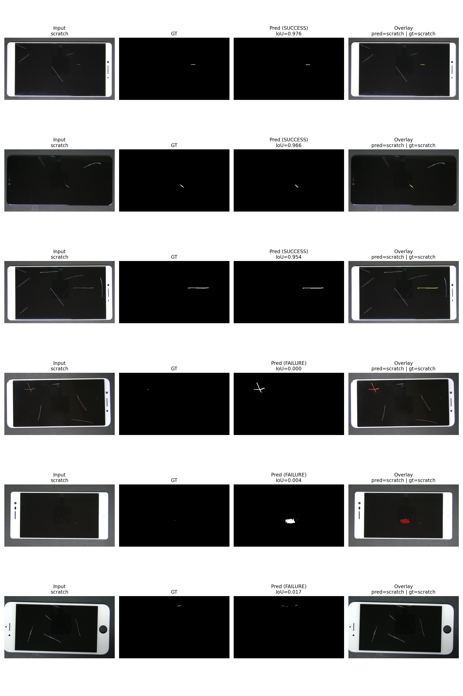
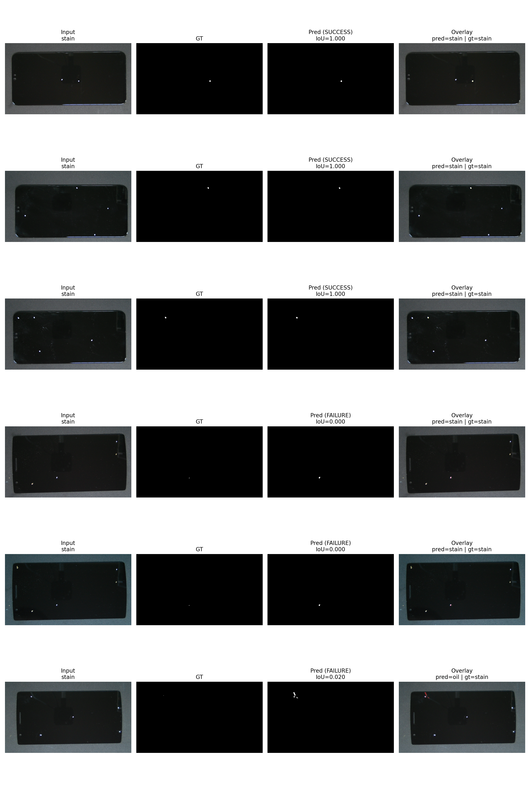

# SAM2 → MobileNetV2 Pipeline for Display Defect Segmentation & Classification (MSD-US)

## Abstract
This project builds an end-to-end defect understanding pipeline for display images using a two-stage approach: **(1) fine-tuned SAM2** for defect segmentation and **(2) MobileNetV2** for defect type classification (**oil / scratch / stain**). We evaluate both segmentation quality and classification performance, including the full end-to-end pipeline (image → SAM2 mask → crop → classifier). Results show that the classifier achieves perfect accuracy on clean cropped patches, while end-to-end performance (**85.83%** accuracy) is limited primarily by segmentation and crop quality.

---

## Method

### Task Definition
Given an input image from the MSD-US dataset, the goal is to:
1. **Segment** the defect region (binary mask).
2. **Classify** the defect type into one of three classes: **oil**, **scratch**, **stain**.

### Dataset Layout
Expected dataset structure:
```
data/MSD-US/test/
  ground_truth/   # binary masks
  oil/            # images
  scratch/        # images
  stain/          # images
```

### Pipeline Overview
1. **Fine-tuned SAM2 Segmentation**
   - SAM2 is fine-tuned on MSD-US.
   - During inference, the model is prompted using automatically sampled points (gradient-based heuristic).
   - The predicted mask is chosen using SAM’s internal confidence score (SAM-score).

2. **Patch Generation**
   - The predicted defect mask is converted into a bounding box.
   - A defect patch is cropped from the original image (with padding).

3. **MobileNetV2 Classification**
   - A MobileNetV2 classifier is trained on the cropped patches.
   - Final inference is **end-to-end**: SAM2 generates patch → MobileNetV2 predicts defect type.

### Separate reports

- **SAM2 fine-tuning performance:** [README_sam2_display_defects.md](README_sam2_display_defects.md)  
- **MobileNetV2 training performance:** [README_mobilenetv2_report.md](README_mobilenetv2_report.md)

### SAM2 + MobileNetV2 Pipeline Performance

**Evaluation set summary**
- **Found samples:** 3,104  
- **Counts by class:** oil = 559, scratch = 1,395, stain = 1,150  

**Results**
- **Segmentation (SAM2 fine-tuned):** IoU = 0.9190 · Dice = 0.9578  
- **Classification (MobileNetV2):** Accuracy = 0.9082  
- **End-to-end (IoU ≥ 0.5 & correct class):** Accuracy = 0.8950

**Qualitative examples**
- 
- 
- 


