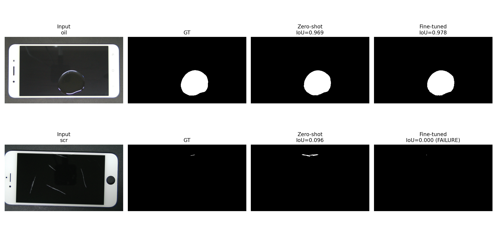

# Fine-tuning SAM2 for Display Defect Segmentation (Scratch / Oil / Stain)

This repo fine-tunes **SAM2** (Segment Anything Model 2) to segment *display surface defects*—**scratch**, **oil**, and **stain**—from RGB inspection images.  
The goal is to improve segmentation quality on small / low-contrast defects where zero-shot SAM2 can struggle.

---

## 1) Problem & Motivation

Display defect segmentation is challenging because defects can be:
- **thin** (scratches),
- **semi-transparent / reflective** (oil films),
- **diffuse / low contrast** (stains),
- and often occupy a **tiny fraction** of pixels.

While SAM2 is strong zero-shot, domain shift + small-object bias can reduce mask quality. Fine-tuning adapts the mask decoder (and optionally prompt encoder) to this specific defect domain.

---

## 2) Dataset

This training script expects **image + binary ground-truth mask** pairs.

Key CLI args:
- `--data_dir` (default: `data/MSD-US/test`)
- `--dataset_format` in `{auto,csv,msd_us}`
- `--gt_dirname` (default: `ground_truth`)
- `--categories` (optional: `oil,scratch,stain`)

### Prompts derived from GT
A **single positive point** is generated per sample using the **center-of-mass of GT foreground** (deterministic).

This makes training/evaluation reproducible and matches a realistic “one-click” prompt at deployment.

---

## 3) Method

### 3.1 Model
- Base: SAM2 checkpoint (default: `sam2_hiera_tiny.pt`)
- Config inferred from checkpoint name (tiny/small/base/large)

### 3.2 What is trained vs frozen (parameter-efficient fine-tuning)
Default behavior in the script:
- ✅ Train **prompt encoder**
- ✅ Train **mask decoder**
- ❄️ Freeze **image encoder**

You can change this via flags:
- `--no_train_prompt_encoder`
- `--no_train_mask_decoder`
- `--no_freeze_image_encoder`

### 3.3 Prompting strategy
- One **positive point** per GT mask (no boxes, no negative points).
- Inference uses that point prompt and requests **3 candidate masks** from SAM2 (`multimask_output=True`).

### 3.4 Key training innovations in this repo (from `train.py`)

#### (A) **Oracle best-of-3 selection during training**
SAM2 outputs 3 candidate masks per prompt. During training, you compute IoU against GT for all 3 and select:

> **k_best = argmax IoU(GT, mask_k)**

Then you backprop **only through the best candidate**.

Why it matters for scratch/oil/stain:
- Defects are subtle; the “best” candidate may *not* be the one with the highest SAM score early in training.
- Oracle selection provides a **cleaner learning signal** (stronger supervision) for small objects.
- **Multi-defect → single-defect preprocessing:** for images that originally contain multiple defects, I split them into **separate single-defect samples** (one GT mask per sample). This ensures each prompt corresponds to exactly **one target defect**, reducing ambiguity and making the oracle selection signal more reliable.

#### (B) **Segmentation loss = BCEWithLogits + Soft Dice**
- `seg_loss = 0.5 * BCEWithLogits(best_logits, GT) + 0.5 * SoftDice(sigmoid(best_logits), GT)`

Why it matters:
- Dice helps with **class imbalance** (defects are small).
- BCE stabilizes pixel-wise learning.

### 3.5 Validation during training
Every `--eval_every` steps:
- run deterministic subset evaluation on `eval_data`
- compute `val_mean_iou`
- save `fine_tuned_sam2_best.torch` when improved
- optional early stopping via `--early_stop_patience`

---

## 4) Training setup

### 4.1 Install
Create your environment (example):

```bash
conda create -n sam2_defects python=3.11 -y
conda activate sam2_defects
pip install -r requirements.txt
<<<<<<< HEAD
```
=======
```

>>>>>>> 5259cfd20509f35f733d28c628f48563ac6c4d1d

### 4.2 Train
Example command:

```bash
python train.py \
  --data_dir data/MSD-US/test \
  --dataset_format msd_us \
  --categories scratch,oil,stain \
  --steps 10000 \
  --lr 1e-4 \
  --weight_decay 1e-4 \
  --max_side 512 \
  --eval_every 200 \
  --eval_samples 200 \
  --save_every 500 \
  --out_dir checkpoints \
  --use_best_for_test
```

Notes:
- Uses AMP (`autocast`) + `GradScaler` on CUDA
- Uses gradient accumulation via `--accumulation_steps` (default 4)

---

## 5) Evaluation

Evaluation is integrated at the end of `train.py` and compares:

- **Zero-shot baseline** (original SAM2 weights)
- **Fine-tuned** (best-val checkpoint if `--use_best_for_test`)

### 5.1 Mask selection rule at inference (deployable)
During evaluation (and intended deployment), you select:

> **mask = argmax predicted_score(mask_k)**

This is critical: it matches what you can do without GT.

### 5.2 Metrics
Per class (scratch/oil/stain), computed from aggregated TP/FP/FN counts:
- IoU
- Dice
- Precision
- Recall

### 5.3 Artifacts produced
Saved to `--out_dir` (default `checkpoints/`):

- `test_metrics_per_class.csv`  
- `test_visual_grid.png` (Input | GT | Zero-shot | Fine-tuned)  
- Console prints include a latency paragraph (p50 / p95)

---

## 6) Results

> Replace the table below with the values from `checkpoints/test_metrics_per_class.csv`.

| Class | n | IoU (Zero-shot) | IoU (Fine-tuned) | Δ IoU | Dice (Zero-shot) | Dice (Fine-tuned) |
|------:|--:|----------------:|-----------------:|------:|-----------------:|------------------:|
oil | 112 | 0.9318 | 0.9647 | 0.9836 | 0.9464 | 0.9436 | 0.9710 | 0.9730 | 0.9690 | 0.0118
scratch | 279 | 0.5248 | 0.6884 | 0.5276 | 0.9901 | 0.7575 | 0.8620 | 0.7879 | 0.9515 | 0.2327
stain | 230 | 0.0665 | 0.1248 | 0.0668 | 0.9476 | 0.7895 | 0.8824 | 0.8485 | 0.9192 | 0.7230

### Qualitative comparison



---

## 7) Deployment notes

Target deployment: an automated display-inspection pipeline on a tester/inspection workstation.

Recommended inference flow:
1. Resize input (longest side capped, same as training).
2. Provide one prompt point (human click or heuristic center point).
3. Run SAM2, request 3 candidates, select by **highest predicted score**.
4. Threshold at 0.5 to get a binary mask.

If you need higher recall, lower the threshold; if you need fewer false positives, increase threshold.

---

## 8) Limitations & Future work

- **Only positive points** are used. Adding **negative points** or **box prompts** may reduce false positives.
- **Single-instance assumption** per image (one prompt point). Multi-defect images may require multi-point prompting.
- Consider lightweight **data augmentation** (contrast/blur/noise) to improve robustness across inspection conditions.
- Consider unfreezing (or LoRA/adapter on) parts of the **image encoder** if domain shift is large.
